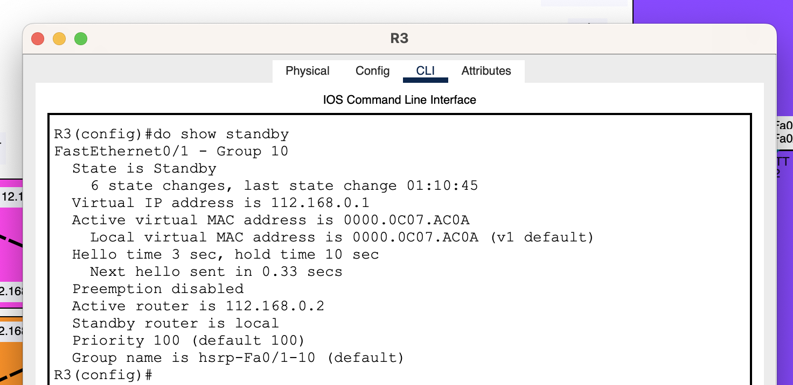
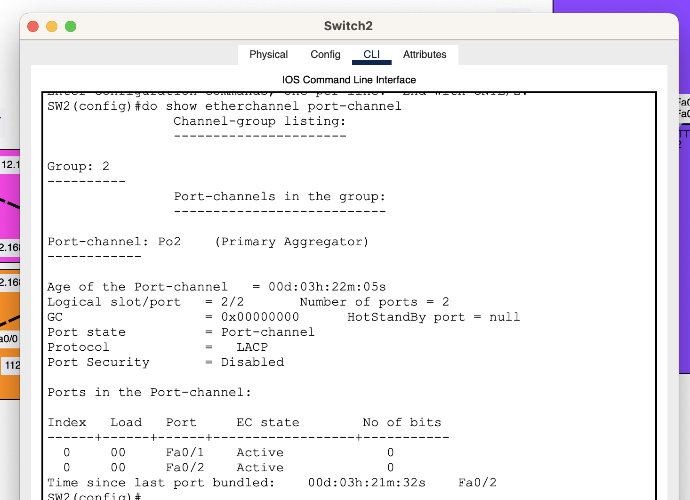

# PRACTICA 2

|  |  |
|----------|----------|
| Enrique Fernando Gaitá Ibarra | 202110531 |

## CONFIGURACIONES

### Router 1
```cisco
enable
conf t
no ip domain-lookup
hostname R1
do wr

int fa0/0
ip add 112.168.1.2 255.255.255.248
no shutdown
do wr

int fa0/1
ip add 112.168.2.2 255.255.255.248
no shutdown
do wr

int s0/0
ip add 10.0.0.1 255.255.255.252
no shutdown
do wr

ip route 10.0.0.0 255.255.255.252 10.0.0.2 
ip route 112.178.0.0 255.255.255.0 10.0.0.2 
ip route 112.178.1.0 255.255.255.248 10.0.0.2 
ip route 112.178.2.0 255.255.255.248 10.0.0.2 
ip route 112.168.0.0 255.255.255.0 112.168.1.1 
ip route 112.168.1.0 255.255.255.0 112.168.1.1 
ip route 112.168.0.0 255.255.255.0 112.168.2.1
ip route 112.168.2.0 255.255.255.0 112.168.2.1
do wr 
```


### Router 2
```cisco
enable
conf t
no ip domain-lookup
hostname R2
do wr

int fa0/1
ip add 112.168.0.2 255.255.255.0
standby 10 ip 112.168.0.1
standby 10 priority 150
standby 10 preempt
no shutdown
do wr

int fa0/0
ip add 112.168.1.1 255.255.255.248
no shutdown
do wr

ip route 112.178.1.0 255.255.255.248 112.168.1.2 
ip route 112.178.0.0 255.255.255.0 112.168.1.2 
ip route 112.178.2.0 255.255.255.248 112.168.1.2 
ip route 10.0.0.0 255.255.255.252 112.168.1.2
do wr
```


### Router 3
```cisco
enable
conf t
no ip domain-lookup
hostname R3
do wr

int fa0/1
ip add 112.168.0.3 255.255.255.0
standby 10 ip 112.168.0.1
no shutdown
do wr

int fa0/0
ip add 112.168.2.1 255.255.255.248
no shutdown
do wr

ip route 112.178.0.0 255.255.255.0 112.168.2.2 
ip route 112.178.1.0 255.255.255.248 112.168.2.2 
ip route 112.178.2.0 255.255.255.248 112.168.2.2 
ip route 10.0.0.0 255.255.255.248 112.168.2.2 
do wr
```



### Router 4
```cisco
enable
conf t
no ip domain-lookup
hostname R4
do wr

int fa0/0
ip add 112.178.1.1 255.255.255.248
no shutdown
do wr

int fa0/1
ip add 112.178.2.1 255.255.255.248
no shutdown
do wr

int s0/0
ip add 10.0.0.2 255.255.255.252
no shutdown
do wr

ip route 112.168.0.0 255.255.255.0 10.0.0.1 
ip route 112.168.1.0 255.255.255.248 10.0.0.1 
ip route 112.168.2.0 255.255.255.248 10.0.0.1 
ip route 10.0.0.0 255.255.255.252 10.0.0.1 
ip route 112.178.0.0 255.255.255.0 112.178.1.2 
ip route 112.178.1.0 255.255.255.0 112.178.1.2 
ip route 112.178.0.0 255.255.255.0 112.178.2.2 
ip route 112.178.2.0 255.255.255.0 112.178.2.2 
do wr
```


### Router 5
```cisco
enable
conf t
no ip domain-lookup
hostname R5
do wr

int fa0/1
ip add 112.178.0.2 255.255.255.0
standby 20 ip 112.178.0.1
standby 20 priority 150
standby 20 preempt
no shutdown
do wr

int fa0/0
ip add 112.178.1.2 255.255.255.248
no shutdown
do wr

ip route 112.168.0.0 255.255.255.0 112.178.1.1 
ip route 112.168.2.0 255.255.255.248 112.178.1.1 
ip route 112.168.1.0 255.255.255.248 112.178.1.1 
ip route 10.0.0.0 255.255.255.248 112.178.1.1
do wr
```


### Router 6
```cisco
enable
conf t
no ip domain-lookup
hostname R6
do wr

int fa0/1
ip add 112.178.0.3 255.255.255.0
standby 20 ip 112.178.0.1
no shutdown
do wr

int fa0/0
ip add 112.178.2.2 255.255.255.248
no shutdown
do wr


ip route 112.168.0.0 255.255.255.0 112.178.2.1 
ip route 112.168.1.0 255.255.255.248 112.178.2.1 
ip route 112.168.2.0 255.255.255.248 112.178.2.1 
ip route 10.0.0.0 255.255.255.248 112.178.2.1
do wr
```


### PAGP
#### SW1
```cisco
enable
conf t
no ip domain-lookup
hostname SW1
do wr

interface range fa0/1-2
channel-group 1 mode desirable
no shutdown

interface port-channel 1
switchport mode trunk

show etherchannel summary 
```

#### SW0
```cisco
enable
conf t
no ip domain-lookup
hostname SW0
do wr

interface range f0/1-2
channel-group 1 mode auto
no shutdown

interface port-channel 1
switchport mode trunk
```


### LACP
#### SW2
```cisco
enable
conf t
no ip domain-lookup
hostname SW2
do wr

interface range f0/1-2
switchport mode trunk
channel-group 2 mode active
no shutdown
```

#### SW3
```cisco
enable
conf t
no ip domain-lookup
hostname SW3
do wr

interface range f0/1-2
switchport mode trunk
channel-group 2 mode passive
no shutdown
```


#### PC


## COMANDOS
- Creación de ruta estática: ```ip add 112.178.0.3 255.255.255.0```
- Creación de PortChannel con PAGP y LACP:
```bash
# PAGP - SW0
interface range fa0/1-2
channel-group 1 mode desirable
no shutdown

interface port-channel 1
switchport mode trunk

# PAGP - SW1
interface range f0/1-2
channel-group 1 mode auto
no shutdown

interface port-channel 1
switchport mode trunk
```

```bash
# LACP - SW2
interface range f0/1-2
switchport mode trunk
channel-group 2 mode active

# LACP - SW3
interface range f0/1-2
switchport mode trunk
channel-group 2 mode passive
```

- Creación de IP virtual con HSRP: ```standby 20 ip 112.178.0.1```
- Configuración de VPC:
